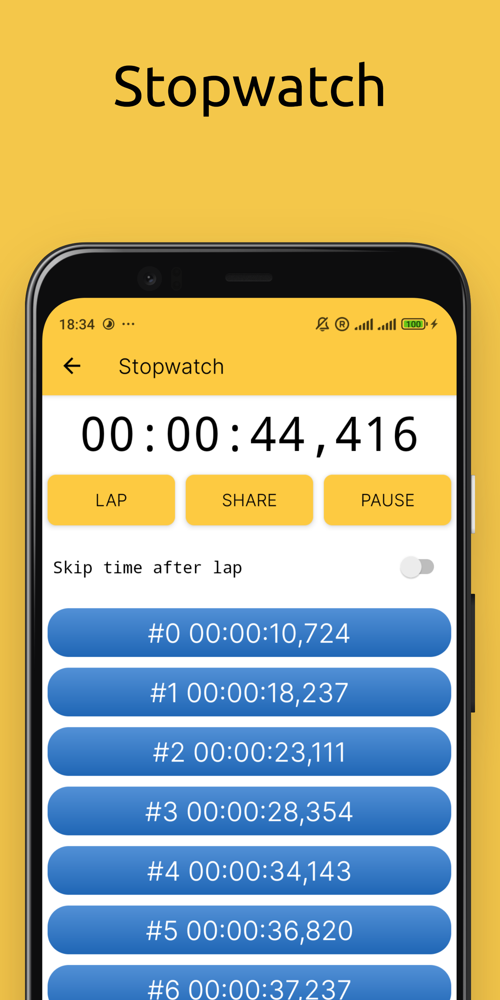

# CTimer: Timer & Stopwatch
 

Simple timer & stopwatch for Android.

Download ctimer apk

## Features
- A timer and stopwatch that you can use on your device for free.
- Flexible customization of the widget on the screen of your device.
- Has a stylish, minimalist design.

Timer, Stopwatch is ideal for the following occasions:
- Conducting competitions. At children's events, weddings or parties you need to time it. It is very easy to do it with our app.
- Sports. Relay races, short and long distance races, swimming and other events require time control.
- Cooking. Cooking often requires measuring the time of frying, boiling or stewing foods.
- Laboratory research. Reaction times are often key in chemical and physical tests. The CTimer app will accurately determine the duration of the process.

## Screenshots
<table>
  <tr>
    <td></td>
    <td></td>
	</tr>
</table>

## Compatibility
Latest version supports Android 8.0+ (Android APi 26+) id 5.0+. All architectures.

## EULA & Privacy Policy
By downloading or opening the application, you accept the [user agreement and privacy policy](https://blindzone.org/eula). 
You may not: copy, modify, translate or create derivative works based on the  CTimer ("Software"); distribute, transfer, publish, disclose, sublicense, lease, lend, sell or rent the Software to any third party; reverse engineer, decompile, reverse decompile or disassemble the Software, or otherwise attempt to derive the source code; make the functionality of the Software available to third parties or multiple users through any means, or benchmark or conduct any performance or comparison tests on the Software. BlindZone LLC reserves all rights in and to the Software not expressly granted to you under EULA.
